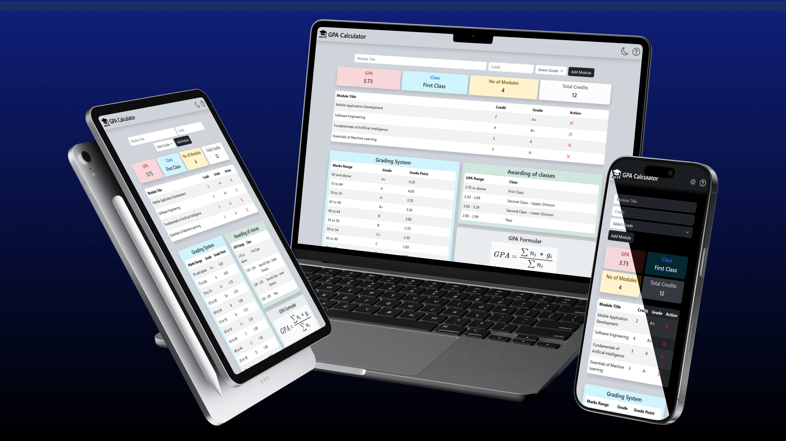

# 🎓 GPA Calculator

GPA Calculator is a web app that helps students calculate their GPA.

---

### 🌐 **Live Demo**: [https://gpa-calc-tool.netlify.app](https://gpa-calc-tool.netlify.app)

---

## 🖼️ Preview


---

## 🚀 Features
- 📱 **Fully mobile-responsive** design for all devices
- ➕ **Add modules** with title, credit value, and selectable grade
- 📊 **Real-time GPA display**: Shows GPA, class based on GPA, total modules, and total credits
- 📋 **Module list view**: See all added modules with credit and grade
- ❌ **Remove modules** anytime
- ✅ **Input validation**
- 🌗 **Dark/Light mode toggle** - switch themes anytime
- 📂 **Local storage support** - your data stays saved between visits
- 🧾 **Helpful references included**: Grading system, class awarding criteria, GPA formula

---

## 🧪 Tech Stack
<table>
  <tr>
    <td align="center">
        <code></code><br/>
        <sup>React.js</sup>
    </td>
    <td align="center">
        <code></code><br/>
        <sup>React Bootstrap</sup>
    </td>
    <td align="center">
        <code></code><br/>
        <sup>Bootstrap</sup>
    </td>
    <td align="center">
        <code></code><br/>
        <sup>JavaScript</sup>
    </td>
    <td align="center">
        <code></code><br/>
        <sup>HTML</sup>
    </td>
    <td align="center">
        <code></code><br/>
        <sup>CSS</sup>
    </td>
  </tr>
</table>

---

## 📦 Dependencies
- `bootstrap-icons`
- `react-toastify`
- `sweetalert2`

---

## 🌍 Deployment
- Hosted on [Netlify](https://www.netlify.com/)
- Continuous deployment from GitHub main branch

---

## 🚀 Getting Started
To run locally:
```
git clone https://github.com/randima-edussuriya/gpa-calculator.git
cd gpa-calculator
npm install
npm run dev
```
Then App will be available at http://localhost:3000 in your browser.

---

## 📜 License
This project is licensed under the [MIT License](./LICENSE).